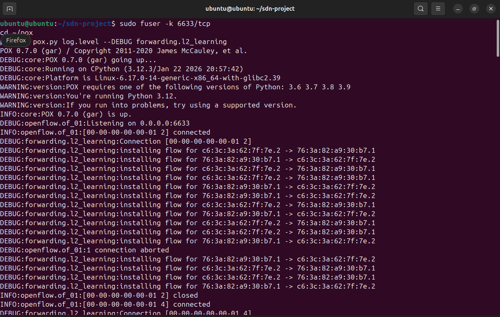
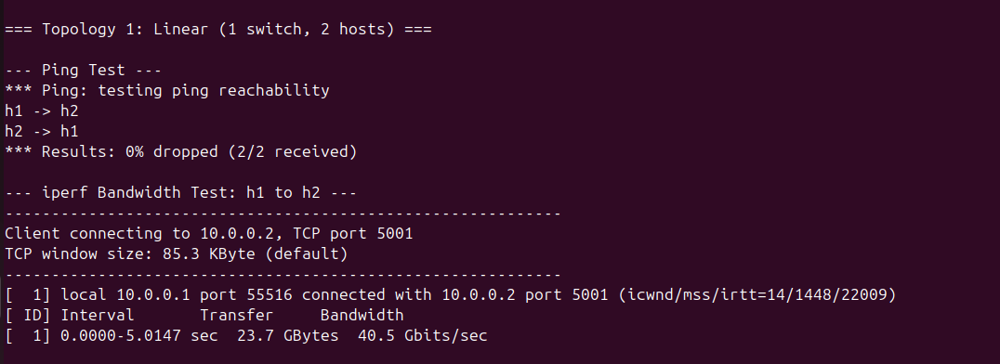
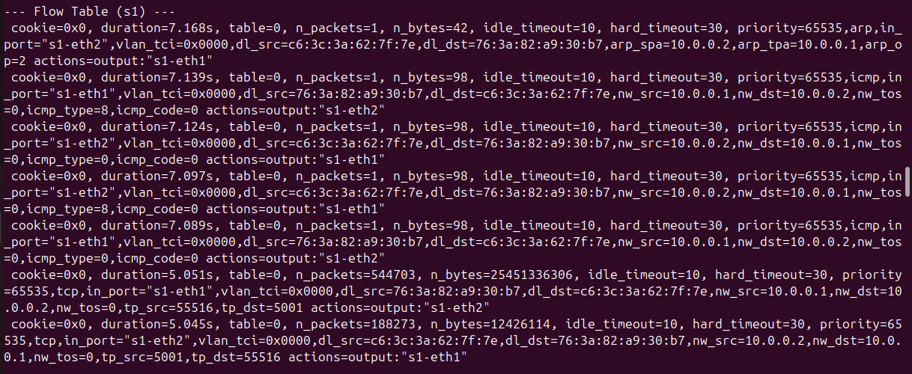
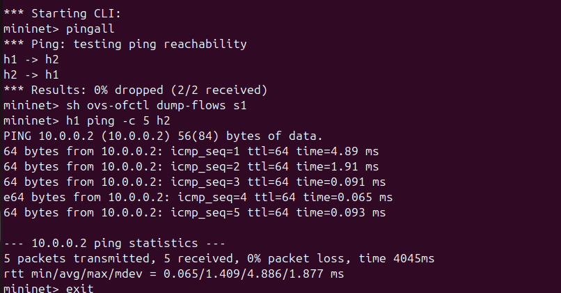
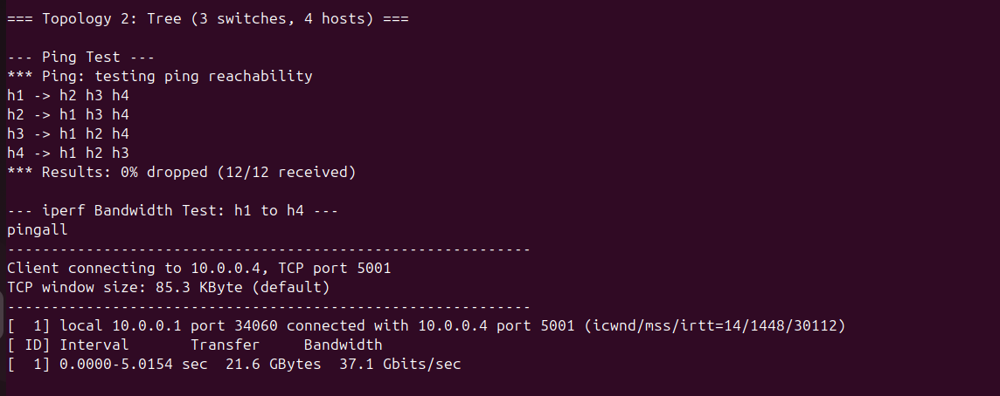
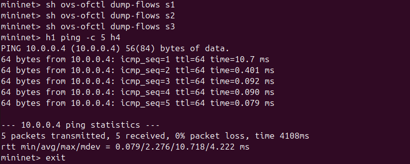

# SDN Bandwidth Measurement and Analysis
### Mininet + POX Controller | OpenFlow SDN Project

---

## Problem Statement

The goal of this project is to implement an SDN-based solution using **Mininet** and the **POX OpenFlow Controller** that demonstrates:

- Controller–switch interaction via OpenFlow protocol
- Flow rule design using match–action logic
- Network bandwidth measurement and comparison across different topologies

**Problem Topic:** Bandwidth Measurement and Analysis — measure and compare bandwidth across different network configurations using iperf across multiple topologies.

---

## Tools Used

| Tool | Purpose |
|---|---|
| Mininet | Network emulation and topology creation |
| POX Controller | OpenFlow SDN controller (l2_learning) |
| iperf | Bandwidth/throughput measurement |
| ovs-ofctl | Flow table inspection |
| ping | Latency measurement |

---

## Topology Design

### Topology 1 — Linear (1 Switch, 2 Hosts)
```
h1 ── s1 ── h2
```
- 1 switch, 2 hosts
- Direct single-hop path between hosts
- Used as the **baseline** for bandwidth measurement
- Simpler path = expected higher throughput

### Topology 2 — Tree (3 Switches, 4 Hosts)
```
        s1
       /  \
      s2   s3
     / \   / \
    h1  h2 h3  h4
```
- 3 switches, 4 hosts
- h1 and h4 are on opposite ends of the tree
- Multi-hop path = more switches traversed
- Used for **comparison** against the linear topology

**Justification:** These two topologies were chosen to observe how network depth and the number of hops affect bandwidth and latency. The linear topology gives a direct baseline, while the tree topology introduces multi-hop routing through the SDN controller.

---

## SDN Logic & Flow Rule Implementation

The **POX l2_learning** module handles all controller logic:

- **packet_in events:** When a switch receives a packet it doesn't know how to forward, it sends it to the POX controller via a `packet_in` event
- **MAC Learning:** The controller learns which port each MAC address is connected to
- **Match–Action Rules:** Once the destination MAC is known, the controller installs a flow rule on the switch with:
  - Match: source MAC, destination MAC, input port
  - Action: output to the correct port
  - Priority: 65535
  - idle_timeout: 10s, hard_timeout: 30s
- **Subsequent packets** are forwarded directly by the switch without involving the controller

This is visible in the POX terminal as:
```
DEBUG:forwarding.l2_learning:installing flow for <src_mac> -> <dst_mac>
```

---

## Setup & Execution

### Prerequisites
```bash
sudo apt install mininet -y
sudo apt install iperf -y
```

### 1. Clone POX Controller
```bash
cd ~
git clone https://github.com/noxrepo/pox
```

### 2. Clone This Repository
```bash
git clone https://github.com/YOURUSERNAME/sdn-bandwidth-analysis
cd sdn-bandwidth-analysis
```

### 3. Start POX Controller — Terminal 1
```bash
sudo fuser -k 6633/tcp
cd ~/pox
python3 pox.py log.level --DEBUG forwarding.l2_learning
```

### 4. Run Topology 1 — Terminal 2
```bash
sudo python3 topo_linear.py
```

Inside Mininet CLI:
```bash
mininet> pingall
mininet> sh ovs-ofctl dump-flows s1
mininet> h1 ping -c 5 h2
mininet> exit
```

### 5. Run Topology 2 — Terminal 2
```bash
sudo python3 topo_tree.py
```

Inside Mininet CLI:
```bash
mininet> pingall
mininet> sh ovs-ofctl dump-flows s1
mininet> sh ovs-ofctl dump-flows s2
mininet> sh ovs-ofctl dump-flows s3
mininet> h1 ping -c 5 h4
mininet> exit
```

---

## Expected Output

### Topology 1 — Linear
- `pingall`: 0% packet loss
- `iperf`: ~40 Gbits/sec (emulated environment)
- Flow table: match+action rules with MAC-based forwarding

### Topology 2 — Tree
- `pingall`: 0% packet loss across all 4 hosts
- `iperf`: ~37 Gbits/sec (slightly lower due to multi-hop path)
- Flow tables on all 3 switches showing learned routes

---

## Proof of Execution

### Screenshot 1 — POX Controller Running + Flow Installation


**What this shows:**
- POX 0.7.0 successfully started and listening on port 6633
- Switch connected: `[00-00-00-00-00-01]`
- POX actively handling `packet_in` events and installing flow rules between MAC addresses
- Lines like `installing flow for c6:3c:... -> 76:3a:...` confirm match–action rules are being pushed to the switch in real time

---

### Screenshot 2 — Topology 1: Linear Ping + iperf Results


**What this shows:**
- `pingall` result: **0% dropped (2/2 received)** — both hosts can reach each other
- iperf result: **40.5 Gbits/sec** over a 5 second test from h1 to h2
- This is the baseline bandwidth for a single-switch, direct-path topology
- High throughput is expected since traffic only passes through 1 switch

---

### Screenshot 3 — Topology 1: Flow Table (s1)


**What this shows:**
- Flow rules installed by POX on switch s1
- Each rule has: `priority=65535`, `idle_timeout=10`, `hard_timeout=30`
- Rules match on: `in_port`, `dl_src` (source MAC), `dl_dst` (destination MAC), IP addresses, and protocol (icmp/tcp)
- Actions: `output:"s1-eth1"` or `output:"s1-eth2"` — directing traffic to the correct port
- `n_packets` and `n_bytes` confirm real traffic was matched and forwarded by these rules
- This proves explicit OpenFlow flow rule installation is working correctly

---

### Screenshot 4 — Topology 1: Mininet CLI Validation


**What this shows:**
- `pingall` reconfirmed inside CLI: **0% dropped**
- `h1 ping -c 5 h2` latency results:
  - Min: 0.065 ms, Avg: 1.409 ms, Max: 4.886 ms
- Low latency confirms direct single-hop forwarding is working efficiently
- 5/5 packets received, 0% packet loss

---

### Screenshot 5 — Topology 2: Tree Ping + iperf Results


**What this shows:**
- `pingall` result: **0% dropped (12/12 received)** — all 4 hosts can reach each other
- iperf result: **37.1 Gbits/sec** over a 5 second test from h1 to h4
- Bandwidth is **slightly lower than Topology 1 (40.5 vs 37.1 Gbits/sec)** due to the multi-hop path through 3 switches
- This confirms that topology depth affects network throughput

---

### Screenshot 6 — Topology 2: Ping Latency (h1 to h4)


**What this shows:**
- `h1 ping -c 5 h4` latency results:
  - Min: 0.079 ms, Avg: 2.276 ms, Max: 10.718 ms
- Latency is **higher than Topology 1** (avg 2.276ms vs 1.409ms) because packets travel through more switches (s2 → s1 → s3)
- This validates that multi-hop paths increase latency as expected in real networks

---

## Performance Analysis & Comparison

| Metric | Topology 1 (Linear) | Topology 2 (Tree) | Observation |
|---|---|---|---|
| Bandwidth | 40.5 Gbits/sec | 37.1 Gbits/sec | Linear is ~9% faster |
| Avg Latency | 1.409 ms | 2.276 ms | Tree has ~61% more latency |
| Max Latency | 4.886 ms | 10.718 ms | More hops = more variance |
| Packet Loss | 0% | 0% | Both topologies reliable |
| Switches Traversed | 1 | 3 | Tree has more hops |

**Key Observations:**
1. **Bandwidth decreases** as the number of switches (hops) increases — the tree topology shows ~9% lower throughput than the linear topology
2. **Latency increases** with more hops — the tree topology shows higher average and maximum latency
3. **POX controller correctly handled all packet_in events** and installed proper flow rules on all switches in both topologies
4. **Flow rules with match+action logic** were successfully installed with correct priorities and timeouts, confirming the SDN control plane is functioning correctly

---

## Test Scenarios

### Scenario 1 — Linear Topology (Baseline)
- **Setup:** 1 switch, 2 hosts, direct path
- **Test:** iperf h1 → h2, ping h1 → h2
- **Result:** 40.5 Gbits/sec, 1.409ms avg latency, 0% packet loss
- **Validates:** Basic SDN forwarding, flow rule installation, controller–switch interaction

### Scenario 2 — Tree Topology (Multi-hop Comparison)
- **Setup:** 3 switches, 4 hosts, tree structure
- **Test:** iperf h1 → h4, ping h1 → h4
- **Result:** 37.1 Gbits/sec, 2.276ms avg latency, 0% packet loss
- **Validates:** Multi-switch flow rule propagation, MAC learning across switches, bandwidth degradation with topology depth

---

## References

- Mininet Project: http://mininet.org
- POX Controller: https://github.com/noxrepo/pox
- OpenFlow Specification: https://opennetworking.org/sdn-resources/openflow/
- iperf Network Testing Tool: https://iperf.fr
- Open vSwitch (ovs-ofctl): https://www.openvswitch.org
- James McCauley et al., POX: A Python-based OpenFlow Controller, 2013
